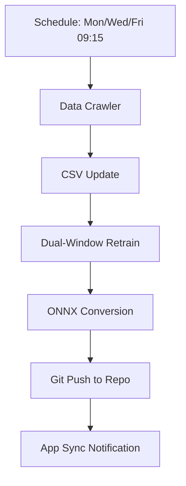

# Technical Wiki: Bicolor AI Prediction Logic

## 1. Feature Engineering (The "Gap & Frequency" Model)
The system calculates several statistical dimensions for every ball (Red 1-33, Blue 1-16):

### Red Ball Features (119 per step)
*   **Gaps (33):** Number of draws since each number last appeared.
*   **Frequency (33):** Appearance rate over the last 30 draws.
*   **Momentum (33):** Appearance rate over the last 5 draws (short-term "heat").
*   **AC Value:** Numerical complexity of the previous draw.
*   **Statistics (10):** Sum, Odd/Even ratio, Big/Small ratio, Prime count, and Range.
*   **Affinity (10):** Co-occurrence correlation between numbers (based on history).

### Blue Ball Features (32 per step)
*   **Gaps (16):** Draws since last appearance.
*   **Frequency (16):** Rate over the last 30 draws.

## 2. Dual-Window Strategy
Our research found that Red and Blue balls behave differently over time:
*   **Red Balls (Window = 50):** Red balls show high sensitivity to "seasonal" patterns. A 50-draw window (approx. 4 months) captures the current "meta" of the structural distribution best.
*   **Blue Ball (Window = 1000):** Blue balls are more chaotic in the short term but highly stable over long durations. A 1000-draw window prevents the model from chasing "fake" short-term patterns.

## 3. Training Process
*   **Algorithm:** XGBoost (Extreme Gradient Boosting).
*   **Objective:** `multi:softprob` (Outputting a probability heatmap for all numbers).
*   **Class Correction:** For small windows (like Red 50), the script injects "dummy samples" for missing numbers to ensure the output layer always contains 33 classes.

## 4. Mobile Inference (ONNX)
To run these complex models on a phone without Python:
1.  **onnxmltools** converts XGBoost trees into a computation graph.
2.  **onnxruntime** executes this graph using native C++/Java/Metal/NNAPI acceleration on the device.
3.  **Dart/Flutter** handles the UI and feature calculation logic in real-time.

## 5. Automation Workflow (GitHub Actions)

